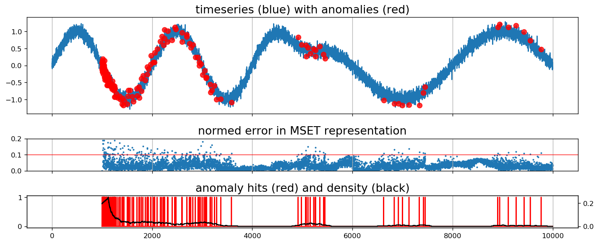

What is this?
---


This is a small numpy/scipy implementation of 
Multivariate State Estimation technique; in particular 
of an "online" approach combined with 
time-delay embeddings to do anomaly detection 
with scalar time series.

Tools to build a fixed dictionary, implement 
strategies to split train/detection phases 
in the absence of ground truth may be added later.

Requirements
---
Python packages:
* numpy
* scipy
* matplotlib (for visualization)

Getting started
---
This is not designed to be installed with a package manager (no pip/conda/etc).
Simply clone the repository where you wish and use the files `mset.py` and `tde.py` 
as modules which you can import.

The script `example.py` runs an example of the 
online anomaly detection on the synthetic 
time series shown at the top of this readme. 

More generally, you may use `mset.py` as a 
package. If you have a vector-valued time series 
`Y`, where the data is arranged in columns, 
the simplest call is 

```
import mset
anomalies = mset.online_mset(Y)
```
